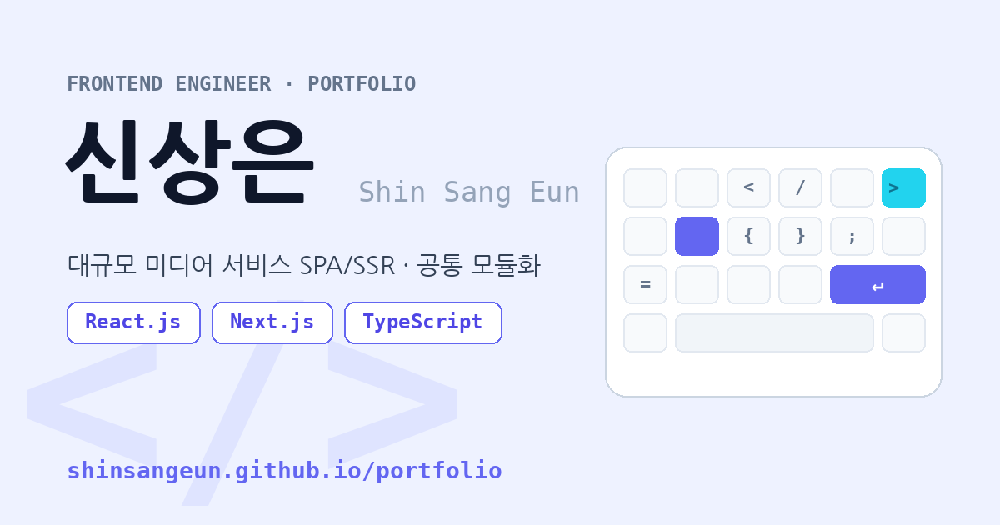

# 🧑‍💻 신상은 — Frontend Engineer Portfolio

대규모 미디어 서비스의 **SPA/SSR 구축**과 **공통 모듈화**에 특화된 프론트엔드 개발자입니다.

## 🔗 포트폴리오 바로가기

### 👉 **https://shinsangeun.github.io/portfolio/**

> 위 이미지를 클릭하면 포트폴리오 페이지로 이동합니다.

## 🛠️ Tech Stack

`React.js` · `Next.js` · `TypeScript` · `JavaScript` · `Node.js` · `Highcharts` · `NX Monorepo` · `CI/CD`

## 📫 Contact

- ✉️ **Email** — s0813se@naver.com
- ✍️ **Blog** — https://shinsangeun.github.io/
- 🐙 **GitHub** — https://github.com/shinsangeun
